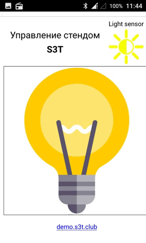
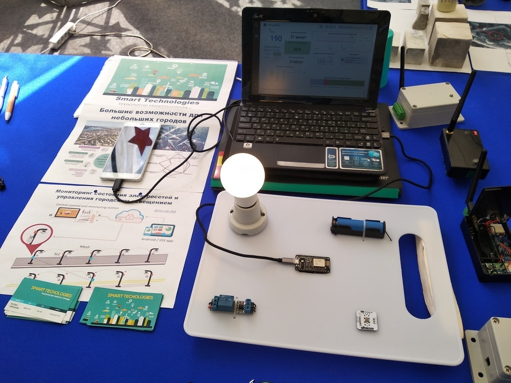

# qt-iot-android-app

An example Android application to control home light (power on/off).

I wrote this project to control my IoT demonstration stand on the 
[iVolga-2018](http://ivolgaforum.ru/) young people forum.

It is communicating with a private MQTT Server. A configured ESP8266 module 
that connected with the MQTT Server listens to the commands from the application.
Also all sent commands store in InfluxDB database and a Grafana system 
visualizes them.

I use QNetworkAccessManager and QJsonDocument for getting and parsing some data 
from the InfluxDB server.

The project fully includes internal QtMqtt library. It is not right, but it works.
